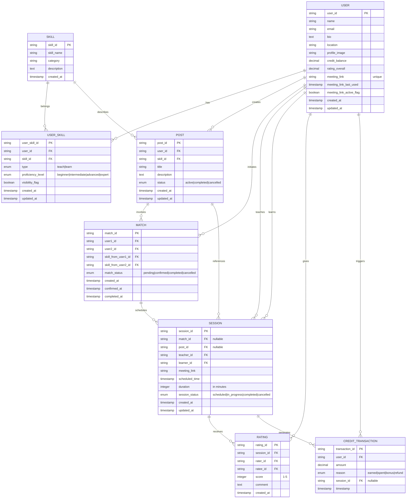

# SkillBumble

A peer-to-peer skill exchange platform where users teach, learn, and grow together without traditional payment barriers.


## 🎯 Project Overview

**SkillBumble** is a community-driven skill exchange system that operates on two flexible models:

### 1. **GiveAndTake Mode** (Barter System)
A direct peer-to-peer skill exchange model where users match when they have complementary learning goals.

- User A wants Skill X, User B wants Skill Y
- User A teaches Skill Y, User B teaches Skill X
- Both users complete their sessions and rate each other
- Perfect for balanced, mutual skill growth

### 2. **EarnCredits Mode** (Credit-Based System)
A one-to-many model where teachers earn credits that can be spent on learning.

- Teacher posts a skill they can teach
- Multiple learners can enroll
- Teacher earns credits: `credits = number_of_learners × sessions_completed`
- Credits can be spent on skills posted by other teachers
- Enables flexible, asynchronous learning paths

## 🚀 Key Features

- **Smart Matchmaking** — Intelligent pairing based on skill compatibility and user preferences
- **Session Management** — Integrated scheduling with meeting link automation
- **Trust & Safety** — Rating system, fraud prevention, and quality control mechanisms
- **Credit Economy** — Fair exchange system with transparent credit calculation
- **User Profiles** — Rich profiles with meeting links, ratings, and skill badges
- **Notifications** — Real-time updates on matches, sessions, and ratings
- **Gamification** — Badges, achievement levels, and leaderboards
- **Analytics Dashboard** — Track learning progress and platform engagement
- **Meeting Links** — Unique, persistent meeting links stored in user profiles

## 📊 Entity Relationship Diagram



## 📋 Database Schema

### User
Represents a platform member with skills, ratings, and meeting capabilities.

| Column | Type | Constraints | Description |
|--------|------|-------------|-------------|
| `user_id` | UUID | PRIMARY KEY | Unique user identifier |
| `name` | VARCHAR(255) | NOT NULL | User's display name |
| `email` | VARCHAR(255) | NOT NULL, UNIQUE | User's email address |
| `bio` | TEXT | - | User biography and introduction |
| `location` | VARCHAR(255) | - | Geographic location |
| `profile_image` | VARCHAR(500) | - | URL to profile picture |
| `credit_balance` | DECIMAL(10,2) | DEFAULT 0 | Current credit balance |
| `rating_overall` | DECIMAL(3,2) | DEFAULT 0 | Average user rating (0-5) |
| `meeting_link` | VARCHAR(500) | UNIQUE, NOT NULL | Persistent meeting link |
| `meeting_link_last_used` | TIMESTAMP | - | Last meeting link usage |
| `meeting_link_active_flag` | BOOLEAN | DEFAULT true | Meeting link active status |
| `created_at` | TIMESTAMP | DEFAULT CURRENT_TIMESTAMP | Account creation date |
| `updated_at` | TIMESTAMP | DEFAULT CURRENT_TIMESTAMP | Last profile update |

### Skill
Catalog of available skills that users can teach or learn.

| Column | Type | Constraints | Description |
|--------|------|-------------|-------------|
| `skill_id` | UUID | PRIMARY KEY | Unique skill identifier |
| `skill_name` | VARCHAR(255) | NOT NULL, UNIQUE | Skill name |
| `category` | VARCHAR(100) | NOT NULL | Skill category (e.g., "Programming", "Languages") |
| `description` | TEXT | - | Detailed skill description |
| `created_at` | TIMESTAMP | DEFAULT CURRENT_TIMESTAMP | Creation date |

### UserSkill
Junction table linking users to skills they can teach or learn.

| Column | Type | Constraints | Description |
|--------|------|-------------|-------------|
| `user_skill_id` | UUID | PRIMARY KEY | Unique relationship identifier |
| `user_id` | UUID | NOT NULL, FK → User | User reference |
| `skill_id` | UUID | NOT NULL, FK → Skill | Skill reference |
| `type` | ENUM | NOT NULL | 'teach' or 'learn' |
| `proficiency_level` | ENUM | DEFAULT 'beginner' | beginner, intermediate, advanced, expert |
| `visibility_flag` | BOOLEAN | DEFAULT true | Whether skill is visible to others |
| `created_at` | TIMESTAMP | DEFAULT CURRENT_TIMESTAMP | Record creation date |
| `updated_at` | TIMESTAMP | DEFAULT CURRENT_TIMESTAMP | Last update date |

### Post
Posts for EarnCredits mode where teachers list skills available for multiple learners.

| Column | Type | Constraints | Description |
|--------|------|-------------|-------------|
| `post_id` | UUID | PRIMARY KEY | Unique post identifier |
| `user_id` | UUID | NOT NULL, FK → User | Teacher who created the post |
| `skill_id` | UUID | NOT NULL, FK → Skill | Skill being taught |
| `title` | VARCHAR(255) | NOT NULL | Post title |
| `description` | TEXT | - | Detailed description of what will be taught |
| `status` | ENUM | DEFAULT 'active' | active, completed, cancelled |
| `created_at` | TIMESTAMP | DEFAULT CURRENT_TIMESTAMP | Post creation date |
| `updated_at` | TIMESTAMP | DEFAULT CURRENT_TIMESTAMP | Last update date |

### Match
Represents GiveAndTake mode matches between two users.

| Column | Type | Constraints | Description |
|--------|------|-------------|-------------|
| `match_id` | UUID | PRIMARY KEY | Unique match identifier |
| `user1_id` | UUID | NOT NULL, FK → User | First user in match |
| `user2_id` | UUID | NOT NULL, FK → User | Second user in match |
| `skill_from_user1_id` | UUID | NOT NULL, FK → Skill | Skill user1 teaches (user2 learns) |
| `skill_from_user2_id` | UUID | NOT NULL, FK → Skill | Skill user2 teaches (user1 learns) |
| `match_status` | ENUM | DEFAULT 'pending' | pending, confirmed, completed, cancelled |
| `created_at` | TIMESTAMP | DEFAULT CURRENT_TIMESTAMP | Match creation date |
| `confirmed_at` | TIMESTAMP | - | When both users confirmed |
| `completed_at` | TIMESTAMP | - | When both sessions completed |

### Session
Represents individual teaching/learning sessions in both modes.

| Column | Type | Constraints | Description |
|--------|------|-------------|-------------|
| `session_id` | UUID | PRIMARY KEY | Unique session identifier |
| `match_id` | UUID | - | FK → Match (null for EarnCredits) |
| `post_id` | UUID | - | FK → Post (null for GiveAndTake) |
| `teacher_id` | UUID | NOT NULL, FK → User | User teaching the skill |
| `learner_id` | UUID | NOT NULL, FK → User | User learning the skill |
| `meeting_link` | VARCHAR(500) | NOT NULL | Meeting link for the session |
| `scheduled_time` | TIMESTAMP | NOT NULL | When the session is scheduled |
| `duration` | INTEGER | DEFAULT 60 | Session duration in minutes |
| `session_status` | ENUM | DEFAULT 'scheduled' | scheduled, in_progress, completed, cancelled |
| `created_at` | TIMESTAMP | DEFAULT CURRENT_TIMESTAMP | Session creation date |
| `updated_at` | TIMESTAMP | DEFAULT CURRENT_TIMESTAMP | Last update date |

### Rating
Feedback and ratings given after each session.

| Column | Type | Constraints | Description |
|--------|------|-------------|-------------|
| `rating_id` | UUID | PRIMARY KEY | Unique rating identifier |
| `session_id` | UUID | NOT NULL, FK → Session | Session being rated |
| `rater_id` | UUID | NOT NULL, FK → User | User giving the rating |
| `ratee_id` | UUID | NOT NULL, FK → User | User being rated |
| `score` | INTEGER | NOT NULL, CHECK (1-5) | Rating from 1 to 5 stars |
| `comment` | TEXT | - | Optional written feedback |
| `created_at` | TIMESTAMP | DEFAULT CURRENT_TIMESTAMP | Rating creation date |

### CreditTransaction
Records all credit movements in the platform.

| Column | Type | Constraints | Description |
|--------|------|-------------|-------------|
| `transaction_id` | UUID | PRIMARY KEY | Unique transaction identifier |
| `user_id` | UUID | NOT NULL, FK → User | User affected by transaction |
| `amount` | DECIMAL(10,2) | NOT NULL | Credit amount (positive or negative) |
| `reason` | ENUM | NOT NULL | earned, spent, bonus, refund |
| `session_id` | UUID | - | FK → Session (if applicable) |
| `timestamp` | TIMESTAMP | DEFAULT CURRENT_TIMESTAMP | When transaction occurred |

## 🛠️ Tech Stack

### Backend
- **Runtime**: Python 3.10+
- **Framework**: FastAPI
- **Database**: MySQL 
- **ORM**: Sequelize / SQLAlchemy
- **Authentication**: JWT + OAuth2
- **API**: RESTful with OpenAPI/Swagger documentation

### Frontend
- **Framework**: React 18+ 
- **UI Component Library**: Material-UI / Tailwind CSS
- **Real-time Updates**: WebSocket / Socket.io
- **Meeting Integration**: Zoom API / Google Meet API / Jitsi


## 📁 Folder Structure

```
skillbumble/
├── backend/
│   ├── src/
│   │   ├── models/          # Database models and schemas
│   │   ├── routes/          # API endpoints
│   │   ├── controllers/      # Business logic
│   │   ├── services/         # Service layer (matchmaking, credit logic)
│   │   ├── middleware/       # Authentication, validation
│   │   ├── utils/            # Helper functions
│   │   ├── config/           # Configuration files
│   │   └── database/         # Migration and seed scripts
│   ├── tests/                # Test suites
│   ├── .env.example          # Environment variables template
│   ├── docker-compose.yml    # Local development setup
│   └── package.json / requirements.txt
│
├── frontend/
│   ├── src/
│   │   ├── components/       # Reusable React/Vue components
│   │   ├── pages/            # Page components
│   │   ├── views/            # Full-page views
│   │   ├── services/         # API client and data fetching
│   │   ├── store/            # State management (Redux/Pinia)
│   │   ├── hooks/            # Custom React hooks
│   │   ├── utils/            # Utility functions
│   │   ├── styles/           # Global CSS/SCSS
│   │   └── types/            # TypeScript type definitions
│   ├── public/               # Static assets
│   ├── tests/                # Component and integration tests
│   └── package.json
│
├── docs/
│   ├── api/                  # API documentation
│   ├── architecture/         # Architecture decisions
│   ├── deployment/           # Deployment guides
│   └── user-guide/           # User documentation
│
├── docker-compose.yml        # Production deployment
├── .github/
│   └── workflows/            # CI/CD pipelines
├── LICENSE
└── README.md
```

## 🚀 Quick Start

### Prerequisites
- Python 3.10+
- MySQL 
- Git


## 📡 API Overview

The API provides endpoints for user management, skill discovery, matchmaking, sessions, and credit management.

### Key Endpoint Categories

| Category | Methods | Endpoints |
|----------|---------|-----------|
| **Users** | GET, POST, PUT | `/api/users`, `/api/users/:id`, `/api/users/profile/me` |
| **Skills** | GET, POST | `/api/skills`, `/api/skills/:id`, `/api/skills/search` |
| **UserSkills** | GET, POST, DELETE | `/api/users/:id/skills`, `/api/users/:id/skills/:skillId` |
| **Posts** | GET, POST, PUT | `/api/posts`, `/api/posts/:id`, `/api/posts/by-skill/:skillId` |
| **Matches** | GET, POST, PUT | `/api/matches`, `/api/matches/:id`, `/api/users/:id/matches` |
| **Sessions** | GET, POST, PUT | `/api/sessions`, `/api/sessions/:id`, `/api/users/:id/sessions` |
| **Ratings** | POST, GET | `/api/ratings`, `/api/sessions/:id/ratings` |
| **Credits** | GET, POST | `/api/credits/balance`, `/api/credits/transactions`, `/api/credits/history` |

### Example: Get User Profile
```bash
curl -X GET http://localhost:5000/api/users/profile/me \
  -H "Authorization: Bearer YOUR_JWT_TOKEN"
```

Response:
```json
{
  "user_id": "uuid-123",
  "name": "Alice Johnson",
  "email": "alice@example.com",
  "rating_overall": 4.8,
  "credit_balance": 150.5,
  "meeting_link": "https://meet.zoom.us/my/alicejohnson",
  "skills_teaching": [
    {
      "skill_id": "skill-456",
      "skill_name": "Python Programming",
      "proficiency_level": "expert"
    }
  ],
  "skills_learning": [
    {
      "skill_id": "skill-789",
      "skill_name": "Spanish Language",
      "proficiency_level": "beginner"
    }
  ]
}
```

### Example: Create a Session (GiveAndTake Mode)
```bash
curl -X POST http://localhost:5000/api/sessions \
  -H "Authorization: Bearer YOUR_JWT_TOKEN" \
  -H "Content-Type: application/json" \
  -d '{
    "match_id": "match-123",
    "teacher_id": "user-456",
    "learner_id": "user-789",
    "scheduled_time": "2024-08-15T14:00:00Z",
    "duration": 60
  }'
```

For complete API documentation, see [API.md](./docs/api/API.md) or visit `/api-docs` when server is running.

## 🤝 Contribution Guidelines

We welcome contributions from the community! Please follow these guidelines:

### Getting Started
1. Fork the repository
2. Create a feature branch (`git checkout -b feature/amazing-feature`)
3. Make your changes
4. Write or update tests to cover your changes
5. Ensure all tests pass (`npm test`)
6. Commit your changes (`git commit -m 'Add amazing feature'`)
7. Push to the branch (`git push origin feature/amazing-feature`)
8. Open a Pull Request

### Code Standards
- Use consistent naming conventions (camelCase for JS, snake_case for Python)
- Write meaningful commit messages
- Add comments for complex logic
- Keep functions small and focused
- Ensure code passes linting checks (`npm run lint`)
- Include unit tests for new features (aim for 80%+ coverage)


### Pull Request Process
1. Update the README.md with details of changes (if applicable)
2. Update CHANGELOG.md with the changes
3. Ensure CI/CD pipeline passes
4. Request review from at least 2 maintainers
5. Address review comments

### Reporting Issues
Use GitHub Issues with a clear description, steps to reproduce, and expected vs actual behavior.

## 📚 Documentation

- [API Documentation](./docs/api/API.md) — Complete API reference
- [Architecture](./docs/architecture/ARCHITECTURE.md) — System design and decisions
- [Database Schema](./docs/database/SCHEMA.md) — Detailed schema documentation
- [Deployment Guide](./docs/deployment/DEPLOY.md) — Production deployment instructions
- [User Guide](./docs/user-guide/USER_GUIDE.md) — How to use the platform

## 🗺️ Future Roadmap

### Phase 1 (Current)
- [x] User authentication and profiles
- [x] Skill management and discovery
- [x] GiveAndTake matching algorithm
- [x] Session scheduling
- [x] Basic ratings system

### Phase 2 
- [ ] EarnCredits mode implementation
- [ ] Credit economy and transactions
- [ ] Advanced matchmaking with ML
- [ ] Notification system
- [ ] Mobile app (iOS/Android)

### Phase 3 
- [ ] Gamification features (badges, leaderboards)
- [ ] Analytics dashboard
- [ ] Group learning sessions
- [ ] Skill endorsements
- [ ] Social features (messaging, forums)

### Phase 4 
- [ ] AI-powered skill recommendations
- [ ] Video lesson library
- [ ] Certification system
- [ ] Integration with external learning platforms
- [ ] Internationalization (i18n)

## 📄 License

This project is licensed under the **MIT License** — see the [LICENSE](LICENSE) file for details.

## 👥 Authors & Acknowledgments

- **Diti Mehta** — Project Lead & Developer
- **Vishwajeet Bharadwaj** — Developer and Beta Tester
- Community contributors and beta testers

## 📞 Support & Contact

- **GitHub Issues** — Report bugs and request features
- **Email** — support@skillbumble.com
- **Discord** — [Join our community](https://discord.gg/skillbumble)
- **Documentation** — Check [docs](./docs/) directory

## 🔒 Security

For security issues, please email security@skillbumble.com instead of using the issue tracker.

### Key Security Practices
- All user passwords are hashed with bcrypt
- JWT tokens expire after 24 hours
- Meeting links are unique and validated
- CSRF protection on all state-changing requests
- SQL injection prevention through parameterized queries
- Regular security audits and penetration testing

---

**Built with ❤️ by the SkillBumble Community**
